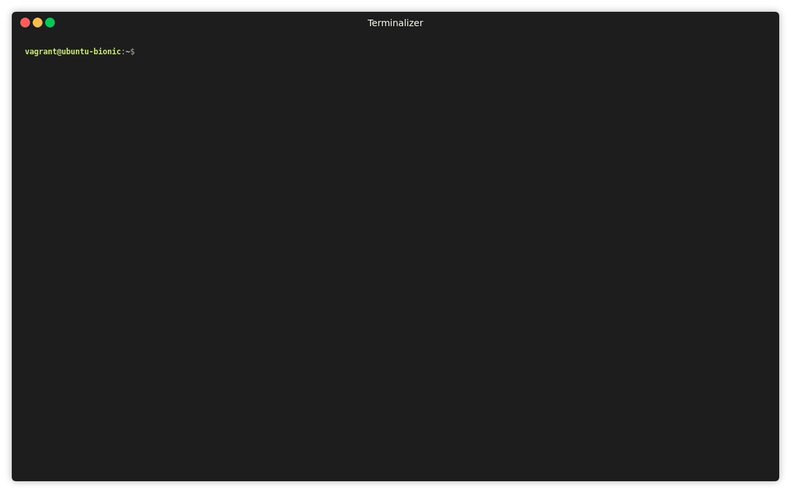

# kubectl-plugins

It is a set of kubectl plugins. It has been tested with [Openshift](https://www.openshift.com).

## Plugins:

- **alertmanager_conf**   Plugin for showing alertmanager config file (namespace: openshift-monitoring)
- **egressnetworkpolicy** plugin for showing egressnetworkpolicy for all namespaces
- **nodeslabel**          Plugin for showing nodes label
- **podevent**            Plugin for showing pods' event
- **podinfo**             Plugin for showing pod information
- **route_whitelist**     Plugin for showing route haproxy ip_whitelist


## Install

```console
[ -d ~/.kube/plugins ] || git clone https://github.com/thobiast/kubectl-plugins.git ~/.kube/plugins
```

## Example



## know issues:

- egressnetworkpolicy: This plugin only works with Openshift. There is no egressnetworkpolicy resource on Kubernetes.
